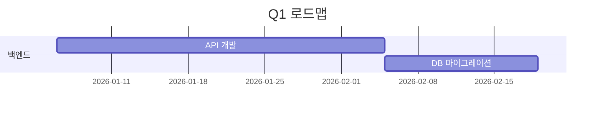

# Obsidian Excel Automation 플러그인

> Obsidian 마크다운 파일에서 전문적인 Excel 보고서를 자동 생성합니다

**버전**: 4.0.0
**작성자**: Jamin Park
**라이선스**: MIT
**데스크탑 전용**: ExcelJS 라이브러리가 Node.js API를 필요로 하여 데스크탑에서만 동작합니다

## 주요 기능

- **4가지 보고서 유형**: 주간(9시트), 분기(6시트), 기능진척(3시트), 블로커추적(2시트)
- **다국어 지원**: 5개 프리셋 — Universal(기본값), English, 한국어, 日本語, Minimal
- **설정 마법사**: 최초 실행 시 소스 파일 경로 가이드 설정
- **경로 검증**: 보고서 생성 전 소스 파일 존재 여부 자동 검증
- **폴더 스캔 모드**: 설정된 폴더에서 마크다운 파일 자동 탐색
- **3상태 작업 추적**: `[ ]` 대기, `[/]` 진행중, `[x]` 완료
- **동적 파일명 템플릿**: `{project}`, `{year}`, `{quarter}`, `{week}`, `{date}` 플레이스홀더
- **원클릭 생성**: 커맨드 팔레트 또는 리본 아이콘으로 즉시 생성
- **자동 감지**: 현재 주차/분기 자동 계산
- **Task Master 통합**: Q1-Q4 분기별 작업 데이터 집계
- **고객요청 추적**: 고객요청현황 전용 시트 제공
- **Executive Summary**: KPI 대시보드, 완료율, 트렌드 분석
- **Dataview 필드 지원**: `field:: value` 인라인 필드 파싱
- **시간 추정 및 시작일**: `⏱️ 2h` 또는 `estimate:: 3 hours`; `🛫 2026-03-01` 시작일
- **커스터마이징**: 파싱 규칙, 스타일, 보고서 구조 설정 가능
- **출력 라우팅**: 보고서 유형별 자동 하위폴더 라우팅
- **전문적 포맷**: 색상, 조건부 서식, 자동 열 너비 조정
- **100% 데이터 정확도**: Obsidian 마크다운에서 직접 파싱

## 설치 방법

### 방법 1: 수동 설치 (권장)

1. **Release에서 파일 다운로드**:
   - `main.js`
   - `manifest.json`
   - `styles.css`

2. **Obsidian 볼트에 복사**:
   ```
   your-vault/.obsidian/plugins/obsidian-excel-automation/
   ├── main.js
   ├── manifest.json
   └── styles.css
   ```

3. **플러그인 활성화**:
   - Obsidian 설정 열기
   - 커뮤니티 플러그인으로 이동
   - "Excel Automation" 활성화

### 방법 2: 소스에서 빌드

**필수 요구사항**: Node.js 18+, npm

```bash
# 저장소 클론
git clone https://github.com/suumpro/Obsidian-excel-report.git
cd obsidian-excel-automation

# 의존성 설치
npm install

# 빌드
npm run build
```

빌드 후 생성된 파일을 볼트의 플러그인 디렉토리로 복사:
```
your-vault/.obsidian/plugins/obsidian-excel-automation/
├── main.js
├── manifest.json
└── styles.css
```

## 빠른 시작

### 1단계: 소스 파일 설정

설정 > Excel Automation에서 경로 설정:

- **기본 경로 (Base Path)**: 마크다운 파일이 위치한 폴더
- **출력 디렉토리 (Output Directory)**: Excel 파일이 저장될 폴더
- **대시보드 파일**: 주간 현황 데이터 소스
- **블로커 파일**: 블로커 추적 데이터 소스

### 2단계: 보고서 생성

**옵션 A**: 왼쪽 리본의 Excel 아이콘 클릭

**옵션 B**: 커맨드 팔레트 사용
- `Cmd/Ctrl+P` 입력
- "Excel" 검색
- 원하는 보고서 유형 선택

### 3단계: 결과 확인

출력 디렉토리에 자동 생성:
- 주간: `Weekly_W05_20260204.xlsx`
- 분기: `Quarterly_Q1_20260204.xlsx`
- 기능: `Features_20260204.xlsx`
- 블로커: `Blockers_20260204.xlsx`

## 사용 가능한 명령어

`Cmd/Ctrl+P`로 커맨드 팔레트를 열고 다음 명령어를 실행:

| 명령어 | 설명 |
|--------|------|
| Generate Weekly Report | 9시트 주간보고서 생성 |
| Generate Quarterly Report | 6시트 분기보고서 생성 |
| Generate Feature Progress Report | 3시트 기능진척보고서 생성 |
| Generate Blocker Tracking Report | 2시트 블로커추적보고서 생성 |
| Generate All Enabled Reports | 활성화된 모든 보고서 일괄 생성 |
| Open Setup Wizard | 소스 파일 경로 및 언어 설정 가이드 마법사 |
| Validate Source File Paths | 설정된 소스 파일 경로 존재 여부 검증 |

## 보고서 유형

### 1. 주간 보고서 (9 시트)

| 시트명 | 내용 |
|--------|------|
| Executive Summary | KPI 대시보드: 완료율, 트렌드 분석, 활성 블로커 |
| 주간현황 | 상세 주간 현황 및 작업 분류 |
| 로드맵진척 | 로드맵 항목별 진척 현황 |
| Q작업상세 | 분기별 전체 작업: 상태, 담당자, 마감일 |
| 블로커추적 | 현재 블로커 현황 및 영향도 |
| 협의사항 | 교차 팀 협의 사항 |
| 마일스톤 | 주요 마일스톤 및 목표일 |
| 플레이북진척 | 플레이북 실행 추적 |
| 고객요청현황 | 고객 요청 상태 및 추적 |

**용도**: 주간 팀 미팅, 진척 보고, 경영진 보고

### 2. 분기 보고서 (6 시트)

| 시트명 | 내용 |
|--------|------|
| Overview | 분기 전체 요약 및 KPI |
| P0_Tasks | 최우선순위 작업 목록 |
| P1_Tasks | 높은 우선순위 작업 목록 |
| Progress_Charts | 진척률 차트 및 시각화 |
| 주차별 진척 | 주차별 진행 현황 추적 |
| 고객요청 추적 | 분기 전체 고객 요청 현황 |

**용도**: 분기별 리뷰, 우선순위 관리, 전략 회의

### 3. 기능진척 보고서 (3 시트)

| 시트명 | 내용 |
|--------|------|
| All_Features | 전체 기능 목록 및 상태 |
| By_Priority | 우선순위별 기능 그룹화 |
| By_Cycle | 개발 사이클별 기능 분류 |

**용도**: 제품 로드맵 추적, 기능 우선순위 관리

### 4. 블로커추적 보고서 (2 시트)

| 시트명 | 내용 |
|--------|------|
| Active_Blockers | 현재 활성 블로커 목록 |
| Blocker_History | 해결된 블로커 이력 |

**용도**: 리스크 관리, 병목 지점 식별, 에스컬레이션

## 설정

### 언어 및 프리셋

5가지 프리셋 지원:
- **Universal** (기본값): 언어 중립적 기본 프리셋
- **한국어**: 한글 시트명, 헤더, 상태값
- **English**: 영문 시트명, 헤더, 상태값
- **日本語**: 일본어 시트명, 헤더, 상태값
- **Minimal**: 최소한의 영문 표시

**변경 방법**: 설정 > Excel Automation > Language에서 프리셋 선택

### 소스 파일 설정

#### 기본 경로
- **Base Path**: 모든 마크다운 파일의 기준 경로
- **Output Directory**: Excel 파일 출력 폴더

#### 데이터 소스
- **Dashboard File**: 주간 현황 데이터
- **Q1-Q4 Status Files**: 분기별 작업 데이터
- **Blockers File**: 블로커 추적 데이터
- **Roadmap File**: 로드맵 데이터
- **Discussions File**: 협의 사항 데이터
- **Task Master Q1-Q4**: 분기별 Task Master 파일
- **Task Master Index**: 연간 Task Master 인덱스
- **Customer Requests**: 고객요청 추적 파일

#### 출력 설정
- **출력 하위폴더**: 보고서 유형별 자동 라우팅 (Weekly/, Quarterly/, Features/, Blockers/)

### 보고서 설정

각 보고서별 활성화/비활성화 및 파일명 포맷 설정:

```
Weekly Report: {week}_{date}
Quarterly Report: {quarter}_{date}
Feature Report: Features_{date}
Blocker Report: Blockers_{date}
```

**플레이스홀더**:
- `{project}`: Base Path에서 추출한 프로젝트 이름
- `{year}`: 현재 연도 (YYYY)
- `{week}`: W01, W02, ... W52
- `{quarter}`: Q1, Q2, Q3, Q4
- `{date}`: YYYYMMDD 형식

### 스타일 설정

색상 커스터마이징:
- **헤더 색상**: 기본값 `#4472C4` (파란색)
- **P0 우선순위 색상**: 기본값 `#FF6B6B` (빨간색)
- **P1 우선순위 색상**: 기본값 `#FFA500` (주황색)
- **P2 우선순위 색상**: 기본값 `#90EE90` (연두색)

### 고급 설정

- **디버그 모드**: 상세 로그 출력 활성화
- **주 시작일**: 일요일 또는 월요일 선택
- **자동 열 너비**: 내용에 맞춰 자동 조정

## 마크다운 작성 형식

### 작업 (Tasks)

#### 기본 체크박스 형식
```markdown
- [ ] 미완료 작업
- [x] 완료된 작업
- [/] 진행중 작업
```

#### 우선순위 표시

**이모지 방식**:
```markdown
- [ ] ⏫ P0 긴급 작업
- [ ] 🔼 P1 높은 우선순위
- [ ] 🔽 P2 일반 우선순위
```

**태그 방식**:
```markdown
- [ ] [P0] 긴급 작업
- [ ] [P1] 높은 우선순위
- [ ] [P2] 일반 우선순위
```

**해시태그 방식**:
```markdown
- [ ] #P0 긴급 작업
- [ ] #P1 높은 우선순위
- [ ] #P2 일반 우선순위
```

#### 시간 추정 및 시작일

```markdown
- [ ] 이모지 방식 ⏱️ 2h
- [ ] 인라인 필드 estimate:: 3 hours
- [ ] 시작일 지정 🛫 2026-03-01
```

#### Dataview 스타일 인라인 필드

```markdown
- [ ] API 통합 작업 [owner:: @홍길동] [due:: 2026-03-01]
- [ ] 데이터베이스 마이그레이션 [owner:: @김철수] [due:: 2026-02-15] [status:: 진행중]
```

**지원되는 필드**:
- `owner::` - 작업 담당자
- `due::` - 마감일
- `status::` - 작업 상태
- `priority::` - 우선순위

### 기능 (Features)

```markdown
## F001 - 사용자 인증 시스템
- Status: 진행중
- Priority: P0
- Owner: @홍길동
- Due: 2026-03-15

## F002 - 대시보드 UI
- Status: 계획중
- Priority: P1
- Owner: @김철수
```

**필수 필드**:
- `Status`: 진행중, 계획중, 완료, 보류
- `Priority`: P0, P1, P2
- `Owner`: 담당자 이름

### 블로커 (Blockers)

```markdown
## 높은 우선순위 블로커

### ⚠️ API 속도 제한 이슈
- Impact: 3개 기능에 영향
- Owner: @홍길동
- Opened: 2026-02-01

### ✅ DB 연결 문제
- Resolution: 연결 풀 증가로 해결
- Resolved: 2026-02-05
```

**블로커 상태**:
- `⚠️` - 활성 블로커
- `✅` - 해결된 블로커
- `🔥` - 긴급 블로커

### 테이블

마크다운 테이블도 자동 파싱:

```markdown
| 작업명 | 상태 | 담당자 | 마감일 |
|--------|------|--------|--------|
| API 개발 | 완료 | 홍길동 | 2026-02-10 |
| UI 디자인 | 진행중 | 김철수 | 2026-02-15 |
```

### JIRA ID 연동

JIRA 티켓과 작업 연결:

```markdown
- [ ] 🔗 SA-051 로그인 플로우 구현
- [ ] 🔗 SA-102 대시보드 버그 수정
```

### 분기/영역 태그

분기와 우선순위 또는 영역 태그:

```markdown
- [ ] #q1/p0 Q1 긴급 작업
- [ ] #C2/스냅샷 기능 영역 태그
```

### 완료일 표시

완료된 작업에 날짜 표시:

```markdown
- [x] ✅ 2026-02-05 API 리팩토링 완료
```

### Mermaid Gantt 차트

Task Master 파일의 Mermaid Gantt 블록 파싱:

````markdown

````

## 설정 가져오기/내보내기

### 설정 내보내기

1. 설정 > Excel Automation 열기
2. 하단의 "Export Settings" 버튼 클릭
3. JSON 파일로 저장

### 설정 가져오기

1. 설정 > Excel Automation 열기
2. "Import Settings" 버튼 클릭
3. 이전에 내보낸 JSON 파일 선택

### 초기화

1. 설정 > Excel Automation 열기
2. "Reset to Defaults" 버튼 클릭
3. 모든 설정이 기본값으로 복원

**용도**: 팀원 간 설정 공유, 백업, 마이그레이션

## 문제 해결

### 보고서 생성 실패

**증상**: "Failed to generate report" 오류 메시지

**해결 방법**:
1. 소스 파일 경로가 올바른지 확인
2. 파일이 실제로 존재하는지 확인
3. 파일 읽기 권한이 있는지 확인
4. 출력 디렉토리가 존재하는지 확인
5. 디버그 모드를 활성화하여 상세 로그 확인

### 보고서에 데이터 없음

**증상**: Excel 파일이 생성되지만 데이터가 비어있음

**해결 방법**:
1. 체크박스 형식 확인 (`- [ ]` 형식)
2. 우선순위 표시 확인 (이모지, 태그, 해시태그)
3. 파싱 설정 확인 (정규식 패턴)
4. 마크다운 파일에 실제 작업이 있는지 확인

### 특정 시트만 비어있음

**증상**: 일부 시트는 정상, 일부는 비어있음

**해결 방법**:
1. 해당 시트의 소스 파일 경로 확인
2. 소스 파일에 해당 데이터가 있는지 확인
3. 파싱 패턴이 데이터 형식과 일치하는지 확인

### 디버그 모드 사용

디버그 모드를 활성화하면 상세 로그 확인 가능:

1. 설정 > Excel Automation > Advanced 열기
2. "Debug Mode" 토글 활성화
3. 개발자 콘솔 열기 (`Cmd/Ctrl+Shift+I`)
4. Console 탭에서 로그 확인

**유용한 로그**:
- 파일 파싱 시작/완료
- 감지된 작업 수
- 정규식 매칭 결과
- 오류 스택 트레이스

### 성능 이슈

**증상**: 보고서 생성이 느림

**해결 방법**:
1. 대용량 마크다운 파일 분할
2. 불필요한 보고서 비활성화
3. 캐시 활용 (플러그인이 자동으로 처리)

## 단축키 설정

커스텀 단축키를 지정하여 빠른 접근 가능:

1. 설정 > Hotkeys 열기
2. "Excel" 검색
3. 원하는 명령어에 단축키 지정

**추천 단축키**:
- `Cmd/Ctrl+Shift+W`: Generate Weekly Report
- `Cmd/Ctrl+Shift+Q`: Generate Quarterly Report
- `Cmd/Ctrl+Shift+F`: Generate Feature Progress Report
- `Cmd/Ctrl+Shift+B`: Generate Blocker Tracking Report

## 변경 이력

### v4.0.0 (2026-02-24)

**새로운 기능**:
- Universal 기본 프리셋: 언어 중립적 기본값, 하드코딩 경로 완전 제거
- 설정 마법사: `SetupWizardModal` + `FolderSuggest`/`FileSuggest` 가이드 설정
- 경로 검증: `PathValidator`로 보고서 생성 전 소스 파일 검증
- 3상태 작업 추적: `completed`, `in_progress`, `pending` + `[/]` 체크박스 지원
- 미배정 작업 버킷: 우선순위 미지정 작업 별도 수집
- 시간 추정/시작일: `⏱️ 2h`, `estimate:: 3 hours`, `🛫 2026-03-01` 추출
- 폴더 스캔 모드: `VaultScanner`로 폴더에서 마크다운 파일 자동 탐색
- 동적 파일명 템플릿: `{project}`, `{year}`, `{quarter}`, `{week}`, `{date}` 플레이스홀더

**개선 사항**:
- 다국어 상태 매칭 중앙화: `statusUtils.ts`로 EN/KO/JA 상태 인식 통합
- 모든 보고서 locale strings 적용 (186→10 한국어 문자열로 축소)
- MarkdownParser 6개 서브 파서로 분리 리팩토링
- TypeScript strict mode 완전 적용, 모든 `as any` 캐스트 제거
- 324개 테스트, 17개 스위트, 88% 커버리지

### v3.1.0 (2026-02-06)

**새로운 기능**:
- Task Master Q1-Q4 통합: Mermaid Gantt 파싱 지원
- 고객요청 추적: 주간(고객요청현황) 및 분기(고객요청 추적) 시트 추가
- 주차별 진척 시트: 분기 보고서에 주차별 진행현황 추가
- 출력 하위폴더 라우팅: 보고서 유형별 자동 폴더 분류

**개선 사항**:
- TypeScript Strict 완전 준수: `tsc --noEmit` 오류 0건
- 257개 테스트, 9개 테스트 스위트 통과

**버그 수정**:
- 분기 키 매핑 오류 수정 (DataAggregator)
- 우선순위 색상 키 대소문자 수정 (ExcelGenerator)
- ConfigManager 반환 타입 개선

### v3.0.0 (2026-02-06)

**새로운 기능**:
- Executive Summary 대시보드 추가
- Dataview 인라인 필드 감지 강화
- 정규식 캐싱으로 성능 향상

**개선 사항**:
- 242개 테스트, 71% 코드 커버리지 달성
- 타입 안정성 강화
- 오류 처리 개선

**버그 수정**:
- generateAllReports() 설정 동기화 문제 해결
- 날짜 계산 정확도 향상
- 메모리 누수 방지

### v2.0.0 (2026-02-04)

**새로운 기능**:
- 다국어 지원 (한국어, English, 日本語)
- ConfigManager 중앙집중식 설정 관리
- 4가지 프리셋 템플릿 제공
- 설정 가져오기/내보내기 기능

**개선 사항**:
- 설정 UI 재구성
- 성능 최적화
- 코드 구조 개선

### v1.0.0 (2026-02-03)

**초기 릴리스**:
- 주간, 분기, 기능, 블로커 보고서 생성
- 기본 스타일 설정
- 커맨드 팔레트 통합
- 리본 아이콘 추가

## 자주 묻는 질문 (FAQ)

### Q: 모바일에서 사용할 수 있나요?

A: 아니요. 이 플러그인은 ExcelJS 라이브러리를 사용하며, Node.js API가 필요하여 데스크탑(Windows, macOS, Linux)에서만 동작합니다.

### Q: 여러 볼트에서 사용할 수 있나요?

A: 예. 각 볼트마다 독립적으로 설치하고 설정할 수 있습니다. 설정 내보내기/가져오기 기능을 사용하면 볼트 간 설정을 쉽게 공유할 수 있습니다.

### Q: 커스텀 보고서를 만들 수 있나요?

A: 현재 버전에서는 4가지 기본 보고서만 지원합니다. 향후 버전에서 커스텀 보고서 기능을 추가할 예정입니다.

### Q: 다른 파일 형식(CSV, PDF)으로 내보낼 수 있나요?

A: 현재는 Excel (.xlsx) 형식만 지원합니다. Excel에서 다른 형식으로 변환할 수 있습니다.

### Q: 보고서에 차트를 추가할 수 있나요?

A: 현재 버전은 테이블 기반 보고서만 지원합니다. 차트 기능은 향후 추가될 예정입니다.

## 기여하기

기여를 환영합니다! 다음과 같은 방법으로 참여할 수 있습니다:

1. **버그 보고**: GitHub Issues에 버그 리포트 작성
2. **기능 제안**: 새로운 기능 아이디어 제안
3. **코드 기여**: Pull Request 제출
4. **문서 개선**: 문서 오류 수정, 번역 개선

### 개발 환경 설정

```bash
# 저장소 포크 및 클론
git clone https://github.com/suumpro/Obsidian-excel-report.git
cd obsidian-excel-automation

# 의존성 설치
npm install

# 개발 모드 실행
npm run dev

# 테스트 실행
npm test

# 린트 검사
npm run lint
```

## 지원 및 연락처

- **GitHub Issues**: 버그 리포트 및 기능 요청
- **Discussion**: 일반적인 질문 및 토론
- **이메일**: jamin.park@example.com

## 라이선스

MIT License

Copyright (c) 2026 Jamin Park

Permission is hereby granted, free of charge, to any person obtaining a copy
of this software and associated documentation files (the "Software"), to deal
in the Software without restriction, including without limitation the rights
to use, copy, modify, merge, publish, distribute, sublicense, and/or sell
copies of the Software, and to permit persons to whom the Software is
furnished to do so, subject to the following conditions:

The above copyright notice and this permission notice shall be included in all
copies or substantial portions of the Software.

THE SOFTWARE IS PROVIDED "AS IS", WITHOUT WARRANTY OF ANY KIND, EXPRESS OR
IMPLIED, INCLUDING BUT NOT LIMITED TO THE WARRANTIES OF MERCHANTABILITY,
FITNESS FOR A PARTICULAR PURPOSE AND NONINFRINGEMENT. IN NO EVENT SHALL THE
AUTHORS OR COPYRIGHT HOLDERS BE LIABLE FOR ANY CLAIM, DAMAGES OR OTHER
LIABILITY, WHETHER IN AN ACTION OF CONTRACT, TORT OR OTHERWISE, ARISING FROM,
OUT OF OR IN CONNECTION WITH THE SOFTWARE OR THE USE OR OTHER DEALINGS IN THE
SOFTWARE.

---

**제작**: Jamin Park
**최종 업데이트**: 2026-02-24
**GitHub**: https://github.com/suumpro/Obsidian-excel-report
**버전**: 4.0.0
